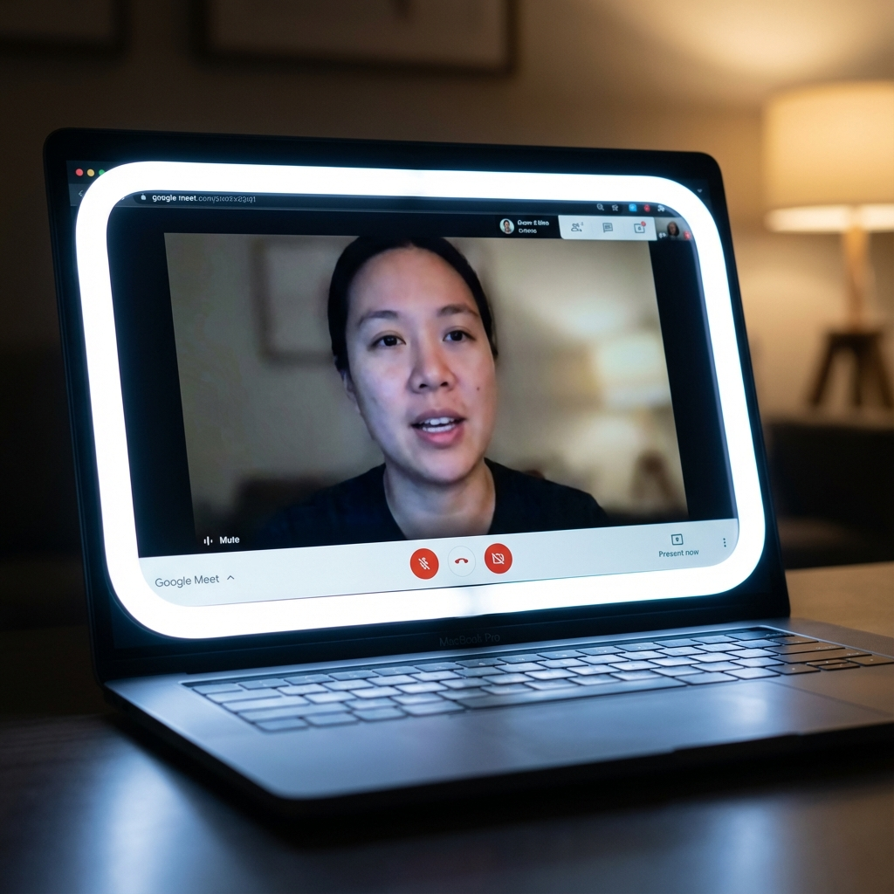

# EdgeLight Chrome Extension

**EdgeLight** transforms your computer screen into a professional ring light. It adds a customizable, glowing border around your browser window that automatically activates when your camera is in use. Perfect for Google Meet, Zoom, and other video conferencing tools.

## Features
- **Smart Auto-Activation**: Lights up only when your camera turns on. Fades out when you stop.
- **Mac-Style Aesthetic**: Designed with a sleek, rounded-corner UI that feels native to macOS.
- **Adjustable Lighting**:
  - **Color Temperature**: Warm (Orange) to Cool (Blue).
  - **Brightness**: Dimmable intensity.
  - **Width**: Adjustable border thickness (up to 85px).
- **Smart Hover**: The light fades out when you move your mouse over it, so you can still access buttons and scrollbars.

## Installation (Manual / GitHub)
Since this extension is not on the Chrome Web Store yet, you can install it manually:

1.  **Download the Code**: Clone this repository or download the ZIP.
2.  **Open Extensions**: In Chrome, go to `chrome://extensions/`.
3.  **Enable Developer Mode**: Toggle the switch in the top-right corner.
4.  **Load Unpacked**: Click the button and select the `EdgeLight` folder (where `manifest.json` is located).
5.  **Pin It**: Click the puzzle piece icon and pin EdgeLight to your toolbar.

## Usage
1.  **Toggle ON**: Click the extension icon and make sure the switch is green.
2.  **Join a Call**: Open Google Meet or Zoom Web. 
3.  **Shine**: As soon as your camera activates, the light will verify and fade in.

## Privacy
EdgeLight operates 100% locally. It listens for camera activity events to trigger the light but does **not** record, transmit, or process any video data.
